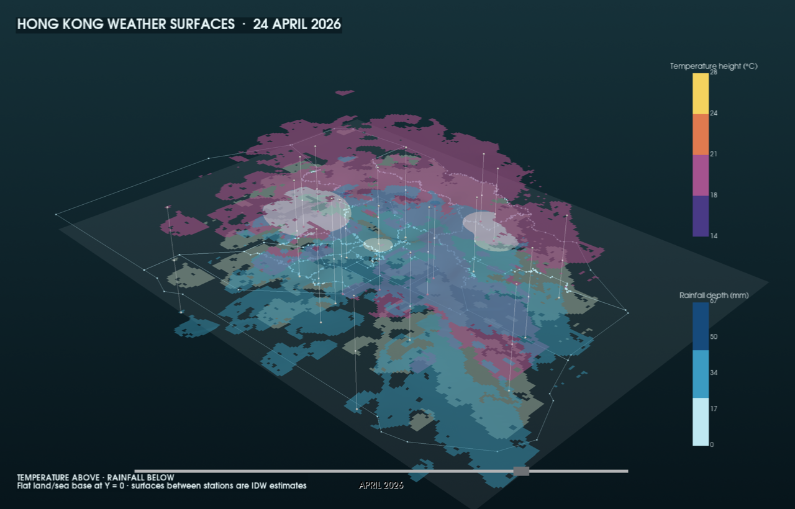

# Hong Kong Weather Surfaces



## The phenomenon

Hong Kong is geographically small, but its daily weather is not uniform. This project shows how mean temperature and total rainfall varied across 21 observation stations during April 2026.

The flat Hong Kong land-and-sea map is the zero plane. Temperature forms a continuous surface above it: warmer observations rise higher and change from purple through orange to yellow. Rainfall forms a second surface below it: larger totals extend farther down and become darker blue. White links show where each measured station constrains the two estimated surfaces.

The scene advances through all 30 days automatically. Its only visible control is a floating draggable timeline. The camera supports 360-degree rotation, zoom, and a pitch restricted to 20–80 degrees. Moving the pointer over the map shows the nearest station's date, mean temperature and total rainfall, while highlighting both measured endpoints.

## Data and method

The observations come from the Hong Kong Observatory datasets for [daily temperature](https://data.gov.hk/en-data/dataset/hk-hko-rss-daily-temperature-info-hko), [daily total rainfall](https://data.gov.hk/en-data/dataset/hk-hko-rss-daily-total-rainfall), and [weather-station locations](https://www.weather.gov.hk/en/cis/stn.htm). The base uses the official [Hong Kong 18-district boundary](https://www.had.gov.hk/en/public_services/public_data/) and locally cached Mapzen tiles only to distinguish land from sea; geographic elevation is not rendered.

April was selected after auditing every completed month from January to August 2026 across 23 same-site candidates. Shau Kei Wan had two incomplete rainfall records and Wetland Park had one incomplete temperature record, so the final tidy dataset contains 630 complete rows: 21 stations × 30 days. Twelve `Trace` rainfall observations are preserved as trace flags and visualised at 0 mm rather than treated as missing.

Both surfaces share one 18,088-node horizontal topology containing exact station nodes. Temperature uses exact k-nearest inverse-distance weighting (IDW) on Celsius values. Rainfall uses local IDW after a `log1p` transform and is converted back to millimetres. Leave-one-station-out validation selected `power=1.5, k=20` for temperature and `power=2.5, k=8` for rainfall. Fixed month-wide ranges—14–28 °C and 0–67 mm—make dates comparable.

The coloured shapes between stations are estimates, not additional measurements. Daily means hide within-day temperature changes, daily totals hide the timing of rain, and surface height is an explanatory visual scale rather than physical altitude. Areas outside the supported Hong Kong land domain are not extrapolated.

## Run the Python version

```bash
uv run plot.py
```

This regenerates `out/hong-kong-weather-april.png` from the same PyVista scene and opens the interactive desktop view. It reads only repository data and needs no network connection.

## Build the static web version

```bash
uv run build_site.py
pnpm --dir web install --frozen-lockfile
pnpm --dir web build
uv run validate_site.py
uv run python -m http.server 8000 --directory site
```

Open `http://127.0.0.1:8000/`. The VTK.js viewer is a fully static client: Python prepares the topology and all 30 frames, then the browser handles rendering and interaction without a server, API key, WebSocket, or CDN.

`.github/workflows/pages.yml` repeats the export, locked frontend build and validation before publishing `site/`. After the repository's Pages source is set to **GitHub Actions** and this work is pushed to `main`, the expected project URL is [https://spathering.github.io/polyu-ap-a2/](https://spathering.github.io/polyu-ap-a2/).
